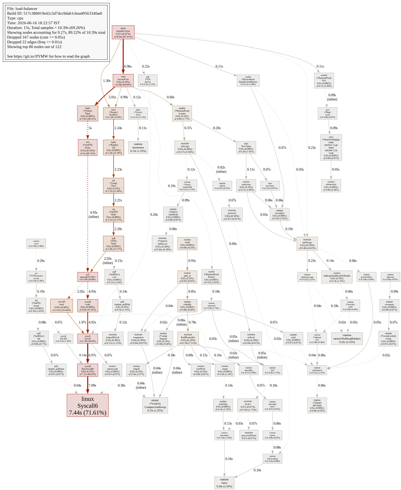
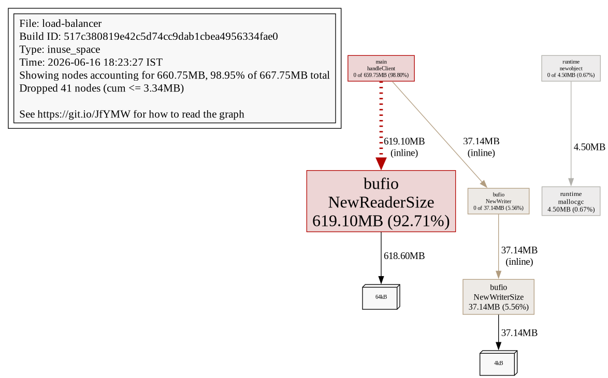

# TCP Load Balancer

A Layer 4 TCP load balancer written in Go, built to explore low-level networking, concurrent systems, health checks, connection pooling, and performance profiling.

## Features

* Least-active backend selection with round-robin tie breaking
* Active health monitoring and automatic failover
* Concurrent connection handling using goroutines
* Configurable backend pools
* Graceful backend recovery
* Performance profiling with `pprof`
* Stress-tested locally at 10,000 concurrent connections

---

## Motivation

This project was built to gain hands-on experience with:

* TCP socket programming
* Concurrent systems in Go
* Backend selection algorithms
* Failure detection and recovery
* Performance analysis and optimization

Unlike HTTP reverse proxies, this operates at **Layer 4** and forwards newline-delimited TCP payloads without parsing HTTP or other application protocols.

---

## Architecture

```text
                ┌─────────────┐
                │   Client    │
                └──────┬──────┘
                       │
                       ▼
             ┌──────────────────┐
             │  TCP Load        │
             │  Balancer        │
             └──────┬───────────┘
                    │
     ┌──────────────┼──────────────┐
     ▼              ▼              ▼
┌────────┐    ┌────────┐    ┌────────┐
│Backend1│    │Backend2│    │Backend3│
└────────┘    └────────┘    └────────┘
     ▲              ▲              ▲
     └────────Response Path────────┘
```

Connection lifecycle:

1. Client establishes a TCP connection to the load balancer.
2. The pool selects a healthy backend using least-active selection with a round-robin starting point.
3. Each newline-delimited client payload is forwarded over a pooled backend connection.
4. The backend response line is returned to the client.
5. The client connection closes when the client disconnects or an unrecoverable read/write error occurs.

---

## Backend Selection

The current implementation routes each request to the healthy backend with the fewest active in-flight requests. When multiple backends have the same active count, selection starts from a rotating index so ties are spread across the pool.

---

## Health Monitoring

The load balancer continuously probes backend health.

### Failure Detection

A backend is marked unhealthy when:

* TCP connection attempts fail
* Health checks timeout

### Failover Behavior

* Unhealthy backends are immediately removed from routing.
* Existing connections may terminate depending on failure mode.
* New connections are routed only to healthy backends.

### Recovery

Periodic health checks automatically restore recovered backends to the pool.

---

## Configuration

Example configuration:

```yaml
listen: ":9000"
metrics_port: ":8000"
dial_timeout: "3s"
backend_pool_size: 8
backends:
  - "127.0.0.1:9001"
  - "127.0.0.1:9002"
  - "127.0.0.1:9003"
```

---

## How to Run

### Build

```bash
git clone https://github.com/DHIBAID/load-balancer.git
cd load-balancer

go build -o loadbalancer .
```

### Start

```bash
./loadbalancer
```

Or:

```bash
go run .
```

The application discovers `config.yaml` from the project root.

---

## Benchmark Results

Stress testing was performed locally on June 16, 2026 using the included backend server and load generator:

```bash
go run ./tests/backends
go run .
go run ./tests/loadgen -target 127.0.0.1:9000 -conns 10000 -duration 5s -size 512
```

| Metric                 | Result       |
| ---------------------- | ------------ |
| Concurrent Connections | 10,000       |
| Backend Servers        | 3            |
| Payload Size           | 512 bytes    |
| Test Duration          | 5 seconds    |
| Requests Sent          | 251,550      |
| Responses Received     | 251,368      |
| Load Generator Errors  | 182          |
| Request Error Rate     | 0.072%       |

The load balancer metrics endpoint reported this snapshot after the benchmark:

```json
{"active_connections":0,"total_requests":520441,"total_errors":11,"bytes_in":266465792,"bytes_out":272711084,"healthy_backends":3,"failed_backends":0}
```

The benchmark verifies that the process can accept 10,000 concurrent TCP clients locally. The error rate above comes from the load generator's send/receive accounting for the measured run.

---

## Performance Profiling (`pprof`)

### CPU Profile



Raw profile data and text summary:

* [docs/cpu.pprof](docs/cpu.pprof)
* [docs/pprof-cpu-top.txt](docs/pprof-cpu-top.txt)

### Heap Profile



Raw profile data and text summary:

* [docs/heap.pprof](docs/heap.pprof)
* [docs/pprof-heap-top.txt](docs/pprof-heap-top.txt)

### Analysis

`pprof` profiling during the benchmark showed **71.61% flat CPU time** in `internal/runtime/syscall/linux.Syscall6`, with `main.handleClient` accounting for **87.01% cumulative CPU time**.

This is expected and desirable for a Layer 4 proxy:

* The load balancer performs minimal application-level processing.
* Most CPU time is naturally spent moving bytes between sockets.
* The small fraction of CPU used by scheduling and routing confirms low application overhead.

The heap profile showed **667.75 MB in-use space**, dominated by per-client buffered readers:

* `bufio.NewReaderSize`: 619.10 MB
* `bufio.NewWriterSize`: 37.14 MB

This is the main memory cost of the current high-concurrency design.

---

## Known Limitations

Current limitations:

* No TLS termination
* No HTTP-layer routing
* No configurable routing strategy
* No weighted routing
* No sticky sessions
* No rate limiting
* No connection draining during shutdown
* No dynamic service discovery

---

## Future Work

* TLS termination
* HTTP/2 and gRPC support
* Prometheus metrics
* Connection draining
* Dynamic backend discovery
* Consistent hashing
* eBPF-based observability
* Zero-copy optimizations

---

## Technologies

* Go
* Goroutines
* TCP sockets
* `net` package
* `sync/atomic`
* `pprof`

---
